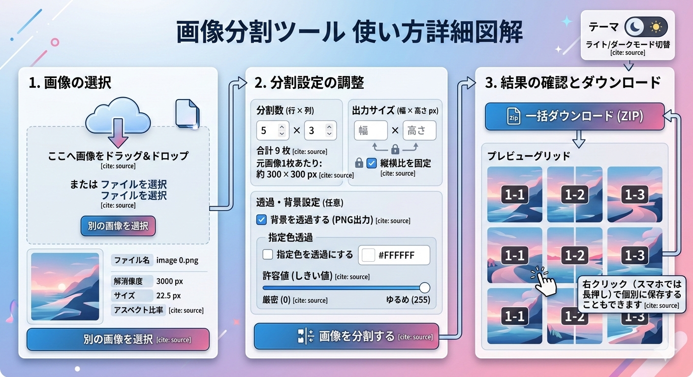

# 画像分割ツール (Image Segmentation Tool)

ブラウザ上で動作する画像分割ツールです。  
ローカル画像を選択・ドラッグ＆ドロップし、指定した行×列でグリッド分割してダウンロードできます。



---

## ✨ 主な機能

| 機能 | 説明 |
|------|------|
| 画像アップロード | ファイル選択ダイアログ、またはドラッグ＆ドロップで画像を読み込み |
| 画像情報表示 | ファイル名、解像度（幅×高さ）、ファイルサイズ、アスペクト比を表示 |
| グリッド分割 | 行数×列数を指定して等分割（デフォルト: 3×3） |
| 出力サイズ指定 | 分割後の画像サイズをピクセル単位で指定可能（拡大・縮小に対応） |
| 縦横比固定 | 出力サイズの縦横比をロック/アンロック切替 |
| 背景透過 (PNG出力) | 元画像の透過情報をそのまま保持してPNG形式で出力 |
| 指定色の透過 | 指定した色（デフォルト: 白）を透過に変換。許容値（しきい値）で範囲調整可能 |
| プレビュー表示 | 分割結果をグリッド状にプレビュー表示 |
| 個別ダウンロード | 各画像を右クリック（スマホでは長押し）で個別に保存 |
| 一括ダウンロード | すべての分割画像をZIPファイルとしてまとめてダウンロード |
| ダーク/ライトモード | テーマ切替ボタンで表示モードを切り替え |

---

## 🚀 使い方

### 1. 画像の選択

- 「ファイルを選択」リンクをクリックしてファイル選択ダイアログから画像を選ぶ
- または、画像ファイルをドロップエリアにドラッグ＆ドロップ
- アップロード後、画像のプレビューとメタ情報（解像度・サイズ・アスペクト比）が表示されます
- 別の画像に変更したい場合は「別の画像を選択」ボタンをクリック

### 2. 分割設定

#### 分割数 (行 × 列)
- **行数**: 縦方向に何分割するかを指定（デフォルト: 3）
- **列数**: 横方向に何分割するかを指定（デフォルト: 3）
- 設定を変更すると「分割予定: 合計 ○枚」と「元画像1枚あたりの幅×高さ」が自動計算されます

#### 出力サイズ (幅 × 高さ px)
- 分割後の各画像のサイズをピクセルで指定
- 初期値は元画像サイズを分割数で割った値が自動設定されます
- 「縦横比を固定」チェックON時は、幅または高さを変更するともう一方が自動調整されます

#### 背景を透過する (PNG出力)
- **チェックON**: PNG形式で出力し、透過情報を保持
- **チェックOFF**: JPEG形式で出力（透過部分は白背景で塗りつぶし）
- PNG画像をアップロードした場合は自動的にONになります

#### 指定色を透過にする
- チェックONにすると追加設定が表示されます:
  - **透過する色**: カラーピッカーで透過にしたい色を選択（デフォルト: 白 `#ffffff`）
  - **許容値 (しきい値)**: 0〜255のスライダーで範囲を調整
    - `0`: 完全一致した色のみ透過（厳密）
    - `30`（デフォルト）: 少し似た色も含めて透過
    - 高い値: より広い範囲の似た色を透過に変換（ゆるめ）
- ONにすると「背景を透過する (PNG出力)」も自動的にONになります

> **💡 ヒント**: 白背景のイラストやロゴから背景を除去したい場合は、「指定色を透過にする」をONにして、デフォルト設定（白, 許容値30）のまま使用してみてください。

### 3. 画像を分割する

- 設定が完了したら「画像を分割する」ボタンをクリック
- 分割処理後、プレビューエリアにグリッド状で結果が表示されます

### 4. ダウンロード

- **個別保存**: プレビュー画像上で右クリック → 「名前を付けて画像を保存」
- **一括保存**: 「一括ダウンロード (ZIP)」ボタンをクリック → ZIPファイルが生成・ダウンロードされます

ファイル名は `元ファイル名_行番号_列番号.拡張子` の形式です。  
例: `photo_1_1.png`, `photo_1_2.png`, `photo_2_1.png` ...

---

## 🎨 テーマ切替

画面右上の月/太陽アイコンボタンでダークモードとライトモードを切り替えられます。  
システム設定がライトモードの場合は、初期表示でライトモードが自動適用されます。

---

## 🛠 技術仕様

| 項目 | 内容 |
|------|------|
| 動作環境 | モダンブラウザ（Chrome, Firefox, Safari, Edge） |
| サーバー不要 | すべての処理はブラウザ内で完結（画像はサーバーに送信されません） |
| 使用ライブラリ | [JSZip](https://stuk.github.io/jszip/) (ZIP生成), [FileSaver.js](https://github.com/nicoleahmed/FileSaver.js) (ファイル保存) |
| フォント | [Noto Sans JP](https://fonts.google.com/noto/specimen/Noto+Sans+JP) (Google Fonts) |
| API | File API, Canvas API, Blob API |

---

## 📁 ファイル構成

```
tools/
├── image-segmentation-tool.html   # ツール本体（HTML/CSS/JS一体型）
└── README.md                      # このファイル
```

---

## ⚠️ 注意事項

- 画像の処理はすべてブラウザ上のメモリで行われます。非常に大きな画像（例: 8000px超）の場合はブラウザの処理性能に依存します。
- 「指定色を透過にする」機能は、RGB色空間のユークリッド距離で色の近さを判定しています。グラデーションのある背景には完全には対応できない場合があります。
- JPEG形式では透過がサポートされないため、透過関連の機能を使用する場合はPNG出力（背景を透過するチェックON）が必要です。

---

## 📝 ライセンス

このツールは個人利用・商用利用ともに自由にご利用いただけます。
